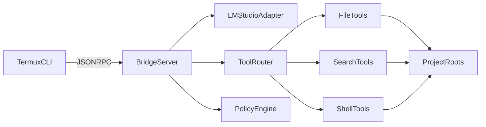

# Arquitectura

## Componentes

- `termux-client`: CLI para enviar tareas y aprobar acciones sensibles.
- `agent-server`: API JSON-RPC que orquesta LLM, herramientas y politicas.
- `LM Studio`: backend de inferencia local compatible OpenAI.

## Flujo

1. Termux envia `chat.run` con mensaje, proyecto y flags.
2. Servidor construye contexto y llama al modelo.
3. Si el modelo solicita herramienta, el servidor valida politicas.
4. Se ejecuta herramienta, se audita y se devuelve resultado al modelo.
5. El loop termina cuando el modelo retorna respuesta final.

## Mermaid

